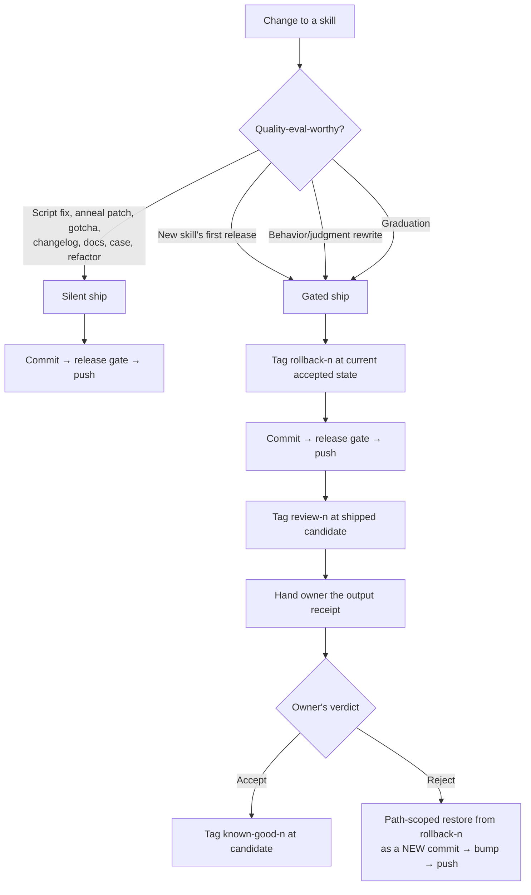
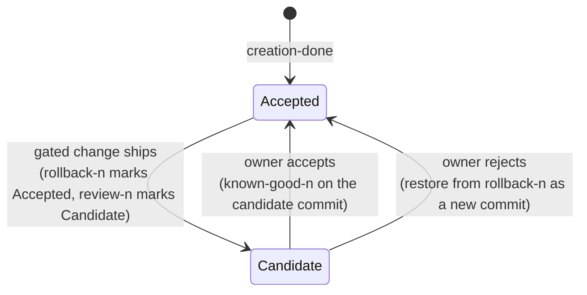

# Autonomous Push Policy for the Skill Factory - Plan

## Goal Capsule

**Objective.** Make the factory ship its own work without asking — commit *and* push by default — and convert the human gate from a pre-push block into a post-ship output review backed by a rollback tag.

**Authority hierarchy.** The owner's settled decisions (KTD1–KTD6) outrank this plan's reasoning. This plan outranks the current instruction text it replaces. The standing rule "never modify a CLAUDE.md without explicit approval" outranks everything here — see KTD10 for how approval is obtained.

**Stop conditions.** Stop and ask if: a settled decision turns out to be infeasible; the verbatim instruction text in U1/U9 needs material rewording at apply time; or the release gate (U8) cannot be made to fail closed.

**Execution profile.** Instruction-text rewrite plus one new release-gate script. No changes to skill behavior beyond the push/gate policy. Verification is behavioral replay, not unit tests.

**Tail ownership.** The implementer owns landing this on `main` and pushing it. That push is itself the first exercise of the policy — it must pass the U8 gate.

---

## Product Contract

### Summary

Rewrite the factory's push prohibition into a repo-scoped push rule, define which changes earn a human quality review, and give every gated change a rollback tag plus an output receipt the owner can judge without reading a diff. Add a fail-closed release gate because origin is a public plugin source and every push is a release.

### Problem Frame

The factory refuses to push. [CLAUDE.md:71](../../CLAUDE.md) states "Never push. Never rewrite history," justified by "origin is the public template repo, which builders cannot push to." That justification is false for the owner: origin is `augmentgrowth/skill-factory`, his own org, and he merges PRs into it.

The prohibition collides with a global stewardship contract that treats GitHub closeout as part of every task, and with a `github-autopilot` Stop hook that blocks turn-end while unpushed work exists. The result is a deadlock — the factory will not push, the guard will not let the turn end — which surfaces to the owner as review debt and dirty working trees he cannot clear. He is not a coder and cannot review script or skill diffs.

A second fact reframes the whole change: origin is what `plugin marketplace add` fetches. Pushing is not saving; it is releasing to everyone who installed the factory. The prohibition was blocking the distribution mechanism.

### Requirements

**Push policy**

R1. The push rule is scoped by build home: push when the build home is the owner's with a writable remote; commit locally only when origin is a public template the builder cannot push to.
R2. "Never rewrite history" survives unchanged. Rollback stays a path-scoped restore committed as a new commit; repo HEAD never moves.
R3. The hazard warning distinguishes auto-*commit* crons (still forbidden — they race the one-commit transaction) from pushing already-committed state (safe).
R4. Pushing is authorized per-release by the U8 gate, not by remote write access alone.

**Review gate**

R5. A human review fires only for a new skill's first release, a rewrite of a skill's behavior or judgment, and graduation. Every other change — script fixes, anneal patches, gotchas, changelogs, docs, cases, refactors — commits and pushes silently.
R6. The gate never blocks a push. It ships the change, then hands the owner an output receipt to evaluate.
R7. The owner's review material is skill output against fixed fixtures, never a diff.
R8. Rejection triggers a path-scoped restore, a new version, and a new push — not a history rewrite.

**Rollback**

R9. Every gated change is bracketed by immutable tags identifying the pre-change state and the shipped candidate.
R10. `known-good` retains its current meaning: a state the owner has accepted. An unevaluated candidate is never tagged `known-good`.
R11. Tags reach the remote with the commits that need them.

**Release integrity**

R12. `plugin.json`'s `version` is the single source of truth; both `marketplace.json` version fields derive from it.
R13. A push is refused when manifests disagree, when the outgoing commit range contains unauthorized paths, or when a clean-checkout install of the plugin fails.
R14. A newly created skill is classified public-safe before it can be pushed from a public build home.

**Instruction sources**

R15. The factory spec, the private hub, and the global instructions are updated so none of them contradicts the others on push behavior.
R16. Every CLAUDE.md edit is applied only under explicit approval of its exact final text.

### Scope Boundaries

**In scope.** The four factory skills, the factory spec, the public README, the release gate, and proposed text for the two instruction sources outside this repo.

**Deliberate expansion.** U5 hardens the anneal rollback path, a defect that predates this change. It is pulled in because this policy makes a corrupted rollback publishable to plugin installers, so the existing weakness stops being merely local. Cut U5 and the rollback affordance the review gate depends on (KTD4, KTD9) rests on a guarantee the code does not actually provide.

**Deferred to follow-up work.**

- Implementing `docs/publish-path.md`'s curated export repo. This plan reconciles with that design but does not build it.
- Team sharing (`graduate-skill` Step 6, already deferred there).
- Retrofitting rollback tags onto skills that predate this change.

**Outside this plan's identity.**

- Weakening "never rewrite history" or the one-commit anneal transaction.
- Making auto-commit crons acceptable in a build home.
- Introducing PR ceremony — the owner rejected it (KTD3).
- The stale worktree duplicate at `.claude/worktrees/`, which is a copy, not an enforcement point, and is now gitignored.

---

## Planning Contract

### Key Technical Decisions

KTD1. Rewrite all three instruction sources, scoped by repo, rather than deleting the push rule outright. *(session-settled: user-directed — chosen over a blanket deletion: a stranger cloning the public template still cannot push to origin, so the rule must survive for them.)*

KTD2. The review gate fires only on quality-eval-worthy skill changes; everything else ships silently. *(session-settled: user-directed — chosen over gating every change: the owner cannot review diffs, so gating mechanical work produces debt without producing safety.)*

KTD3. Direct to main always; no PRs, even for gated changes. *(session-settled: user-directed — chosen over PR-per-change: the owner reviews shipped output, and PR ceremony adds a step he would not use.)*

KTD4. The gate is a post-ship output review with a tagged rollback point, never a pre-push block. *(session-settled: user-directed — chosen over a blocking review: matches "for that I'm fine reviewing the output.")*

KTD5. `learn-from-session` keeps owner approval on *what* gets learned, then commits and pushes with no further ask. *(session-settled: user-directed — chosen over full autonomy on mined preferences: the agent cannot know whether it read the owner correctly, but once he confirms, shipping needs no second approval.)*

KTD6. Origin is a public distribution channel; a push is a release to plugin installers. *(session-settled: user-approved — chosen over treating origin as private storage: `plugin marketplace add` fetches from origin, so unpushed work does not exist for anyone else.)*

KTD7. The CRITICAL script-efficiency stop at graduation survives, reframed as an agent-owned fix-and-retest gate rather than a decision handed to the owner. The rubric defines CRITICAL as "will break at real scale or burn money/quota fast" — an operational correctness property, not an output-taste question. Output review cannot detect quota exhaustion, missing pagination, or silent truncation, so ship-and-flag would route a defect to a reviewer structurally unable to catch it. Build-time review already fixes every CRITICAL, so a survivor signals a real defect. *(Chosen over ship-and-flag, which "direct to main always" initially suggested; the gate is machine-to-machine and never asked the owner anything, so it does not conflict with KTD3.)*

KTD8. Static skills keep "never self-edit," but the proposal destination changes: instead of refusing to save when the repo publishes, write the proposal to the private hub's proposal queue. A proposal quotes machine paths and local detail, so it must never enter a public plugin repo — but leaving it as a loose unsaved file destroys the only failure record for a static skill. *(Chosen over both keeping the refuse-to-save rule and publishing proposals; the original rule identified the right hazard and picked the wrong remedy.)*

KTD9. Tagging extends to every gated change under a three-tag vocabulary — `<skill>/rollback-<n>` for the last accepted state, `<skill>/review-<n>` for the shipped candidate, `<skill>/known-good-<n>` added only on acceptance. Reusing `known-good` for an unevaluated candidate would corrupt its current meaning, which is a state the owner judged against a side-by-side. *(Chosen over reusing `known-good` for all three roles.)*

KTD10. Approving this plan authorizes applying only the instruction blocks it reproduces verbatim — the factory spec block in U1 and the README block in U9 — and nothing else. Approval of an architectural description is not approval of unseen instruction text; asking twice after the owner has approved byte-exact blocks is ceremony. The private-hub and global-instruction edits are **not** authorized by this plan: their files are machine-local and were not read during planning, so U9 must show their exact final text at apply time and obtain a separate approval covering both together. Any material rewording of an authorized block also requires fresh approval for that block only.

KTD11. Manifest version synchronization happens in a separate release-finalizer commit after the skill transaction closes. Folding manifest edits into an anneal commit would violate both the skill-folder-only staging rule and the one-anneal-one-commit contract.

KTD12. The release gate fails closed and runs before every push. Path-scoped staging governs what a commit contains; it does not govern what a push sends. With no human diff review anywhere in the loop, an automated gate is the only remaining check between a defect and every plugin installer.

### High-Level Technical Design

**Change classification — what ships silently vs. what ships with a receipt.**

The gate never sits between the change and the push. It sits after.

**Tag lifecycle.** Tags are immutable and never moved or force-updated.

A rejected **first** release has no prior accepted state — undo there means a path-scoped deletion committed as a new release. A rejected **graduation** also requires reinstalling the restored build-home version, because the installed copy is a frozen copy that does not auto-update.

**Release gate.** One script, invoked before every push, failing closed on any check:

1. Manifests agree — `plugin.json`'s `version` equals both `marketplace.json` version fields.
2. Outgoing commit range contains only authorized paths (fetch, require fast-forwardable `main`, inspect every outgoing commit).
3. A clean-checkout install of the plugin succeeds.
4. Any newly created skill in the range carries a public-safe classification.

---

## Implementation Units

### Phase 1 — The contract

#### U1. Rewrite the silent-git contract

**Goal.** Replace the push prohibition with a repo-scoped push rule and split the auto-commit hazard from the push question.

**Requirements.** R1, R2, R3, R15, R16.

**Dependencies.** U8 — the replacement text cites the release gate as the push authorization point, so the gate exists before the spec promises it. U8 is first in execution order despite its position in this document.

**Files.** `CLAUDE.md` (the `## The silent-git contract` section and the auto-commit warning at lines 33–36). `AGENTS.md` is a symlink and needs no separate edit.

**Approach.** Apply this exact replacement for the two bullets that currently read "Never push. Never rewrite history." and "Per-skill known-good tags." Approving this plan authorizes this block (KTD10).

> - **Push when the build home is yours.** If the build home has a remote you own and can write to, the factory commits *and* pushes — closeout is part of the task, not a later step. If origin is a public template you cannot push to (a stranger's clone of this repo), commit locally only and say so plainly once. Pushing is authorized per release by the release gate, not by write access alone.
> - **Never rewrite history.** Rollback is a path-scoped restore committed as a *new* commit. Repo HEAD never moves, and no published commit is ever amended, rebased, or force-pushed.
> - **Per-skill tags.** `<skill>/rollback-<n>` marks the last accepted state before a gated change; `<skill>/review-<n>` marks the shipped candidate; `<skill>/known-good-<n>` is added only after the builder accepts the output. Tags are immutable and push with their commits.

And replace the auto-commit warning with:

> One warning to pass on when relevant: a build home with an automated **commit** cron will corrupt the factory's one-commit transaction discipline — prefer a repo without one. This is about auto-commit, not pushing: pushing already-committed state is safe and is what the factory does by default.

**Patterns to follow.** The existing bullet voice in `## The silent-git contract` — imperative, builder-facing, no git vocabulary leaking to the builder.

**Test scenarios.**
- A zero-history agent reading only `CLAUDE.md` in the owner's clone concludes it should push after a skill change.
- The same agent, in a clone whose origin it cannot write to, concludes it should commit locally and say so once.
- The agent does not conclude that auto-sync repos are now acceptable.

**Verification.** Read the rewritten section cold and confirm no sentence still forbids pushing, and that "never rewrite history" survives intact.

#### U2. Define the review gate and the output receipt

**Goal.** Add one named section both `improve-skill` and `graduate-skill` can cite, defining what is gated and what the owner receives.

**Requirements.** R5, R6, R7, R8.

**Dependencies.** U1.

**Files.** `CLAUDE.md` (new section after the silent-git contract).

**Approach.** Name the three gated categories and state the everything-else default. Define the receipt: for a gated change, preserve the previous accepted output and the candidate output against the same fixtures from `cases/`, and present those two outputs — not a diff — with a plain-language question. State that the gate never delays the push.

**Patterns to follow.** `cases/baseline/output-baseline.md` already establishes captured-output-as-artifact; the receipt is the same shape applied to a change rather than to a skill's birth.

**Test scenarios.**
- An anneal patch, a changelog line, and a gotcha addition each ship with no question asked.
- A new skill's first release produces a receipt naming both outputs.
- The receipt contains no diff, no file paths, and no git vocabulary.
- A rejection routes to path-scoped restore, not to a revert of the push.

**Verification.** The section is citable in one line from another skill and does not restate the gate's mechanics in each skill.

#### U3. Tag vocabulary and plain-language undo

**Goal.** Specify the three tags and how "undo that" resolves for each rollback shape.

**Requirements.** R9, R10, R11, R2.

**Dependencies.** U1.

**Files.** `CLAUDE.md` (extend the beginner-vocabulary block).

**Approach.** Define tag creation points and immutability. Specify that `git push` does not carry tags by default, so the branch and its new tags publish together or the release is not complete. Cover three undo shapes: normal (restore the folder from `rollback-<n>`), rejected first release (path-scoped deletion committed as a new release), and rejected graduation (restore plus reinstall the personal copy, which is frozen).

**Test scenarios.**
- "Undo that" after a rejected behavior rewrite restores only the named skill's folder; repo HEAD does not move.
- "Undo that" after a rejected first release removes the skill without touching any other.
- "Undo that" after a rejected graduation also refreshes the installed copy.
- A tag created locally is present on the remote after the release completes.

**Verification.** Each undo shape is expressible to the owner in one sentence containing no git vocabulary.

### Phase 2 — The skills

#### U4. `improve-skill`: push, tagging, background runs, static proposals

**Goal.** Bring the anneal loop under the new policy.

**Requirements.** R1, R5, R9, KTD8.

**Dependencies.** U1, U2, U3.

**Files.** `.claude/skills/improve-skill/SKILL.md` (bounds at line 246; the tagging prohibition at line 165; the static-proposal destination at lines 60–65; the background-run note at line 187), `.claude/skills/improve-skill/CHANGELOG.md`.

**Approach.** Replace the "Never push" bound with a pointer to the silent-git contract. Reverse the tagging prohibition: an anneal is not a `known-good` milestone, but a *gated* change still gets `rollback-`/`review-` tags — state both halves so the reversal is not read as "tag everything." Authorize pushing in background runs, where there is no one to escalate to live. Change the static-proposal destination per KTD8.

**Execution note.** Line 165's prohibition is explicit and load-bearing; state the rationale for the reversal in the edit itself, or a future reader will restore it.

**Test scenarios.**
- An anneal on a non-gated fix commits and pushes with no question.
- The same anneal creates no `known-good` tag.
- A behavior rewrite creates `rollback-` and `review-` tags and produces a receipt.
- A static skill's proposal lands in the private hub queue, never in this repo.
- A background anneal pushes and leaves its plain-language account in the commit body.

**Verification.** Replay the two committed cases under `cases/` and confirm both still pass, with a push now occurring.

#### U5. Harden the anneal rollback path

**Goal.** Make the Step 7 restore actually preserve the case directory it claims to preserve.

**Requirements.** R2, R8.

**Dependencies.** U4.

**Files.** `.claude/skills/improve-skill/SKILL.md` (Step 7, lines 169–187), `.claude/skills/improve-skill/cases/<date>-rollback-preserves-case/`.

**Approach.** Step 7 restores the whole skill folder from an older ref while asserting the newer case directory survives, and the Gotchas section calls the case commit sacred. Neither claim is enforced: the different restore forms behave differently, and files created during fix attempts are untracked and unaffected by a checkout. Track attempt-created paths, restore tracked changes while excluding the active case directory, remove only attempt residue, then assert `input.md`, `expected.md`, and the terminal marker are present before committing.

**Execution note.** This is a pre-existing defect, not one this policy introduces — but the policy makes a corrupted rollback publishable, which is why it lands here. Capture a failing case first, per the repo's own convention.

**Test scenarios.**
- A rollback after three failed attempts leaves `input.md` and `expected.md` byte-identical.
- Files created during a failed attempt are gone after the rollback.
- The case commit is never staged with the restore.
- The terminal marker is present, so the queue does not re-run the case.

**Verification.** The committed failing case replays green.

#### U6. `graduate-skill`: reframe the CRITICAL gate

**Goal.** Keep the CRITICAL block but make it agent-owned, and wire graduation into the tag vocabulary.

**Requirements.** R5, R9, KTD7.

**Dependencies.** U2, U3.

**Files.** `.claude/skills/graduate-skill/SKILL.md` (line 38 and Step 5), `.claude/skills/graduate-skill/CHANGELOG.md`.

**Approach.** Restate the CRITICAL stop as a machine gate: the agent fixes the finding and re-runs the checklist; it never hands the owner a severity decision. State why it is not subject to the review gate — it tests an operational property that output review cannot observe. Add `rollback-`/`review-` tagging around graduation and note that a rejected graduation requires reinstalling the restored version.

**Test scenarios.**
- A seeded N+1 loop blocks graduation, is fixed by the agent, and graduation proceeds without the owner being asked to judge severity.
- A HIGH finding does not block.
- A procedure-only skill skips the step with no ceremony.
- Graduation produces a receipt and both tags.

**Verification.** Graduate a script-backed test skill with a seeded CRITICAL and confirm the owner is never asked a technical question.

#### U7. `learn-from-session`: auto-push approved edits

**Goal.** Keep approval on what is learned; remove the second ask before shipping.

**Requirements.** R5, KTD5.

**Dependencies.** U1.

**Files.** `.claude/skills/learn-from-session/SKILL.md` (lines 5, 10, 12, 47–48), `.claude/skills/learn-from-session/CHANGELOG.md`.

**Approach.** Keep propose-first framing for the mining step. Replace "never push" in the apply step with a pointer to the silent-git contract, and say the approval covers shipping. Preserve the static-skill distinction at lines 55–56 — an approved edit still applies to a static skill.

**Test scenarios.**
- The owner approves two of four mined signals; exactly two edits apply, commit, and push.
- Declined signals are discarded, not queued.
- The owner is not asked a second time before the push.
- An approved edit to a static skill still applies.

**Verification.** Run a session-mining pass and confirm exactly one approval point.

### Phase 3 — Release integrity and rollout

#### U8. Fail-closed release gate

**Goal.** One gate, run before every push, that refuses to release a broken or unauthorized plugin.

**Requirements.** R4, R12, R13, R14, KTD11, KTD12.

**Dependencies.** None — this unit lands first. The gate is a script plus manifest synchronization and does not need the spec rewritten to work.

**Files.** `scripts/release-gate.sh` (new), `.claude-plugin/plugin.json`, `.claude-plugin/marketplace.json`, `CLAUDE.md` (cite the gate from the push rule), `tests/test_release_gate.py` (new).

**Approach.** Assert three-way version equality; bump `plugin.json`'s `version` when the installable surface changes and derive the two marketplace values from it; audit the outgoing commit range against an authorized path set; smoke-install the plugin from a clean temporary checkout; require a public-safe classification for any newly created skill. Manifest sync is its own release-finalizer commit after the skill transaction closes and the lock is released.

**Execution note.** The manifests are already drifted (`0.3.2` vs `0.2.0`); fixing that is the gate's first exercise. Match the script-efficiency rubric in `.claude/skills/graduate-skill/references/script-efficiency-review.md` — this script will be reviewed by the same checklist it protects.

**Test scenarios.**
- Mismatched manifest versions fail the gate.
- An outgoing range touching an unauthorized path fails the gate.
- A malformed skill frontmatter fails the clean-checkout install.
- A new skill with no public-safe classification fails the gate.
- A documentation-only push passes without a version bump.
- The gate is never invoked between case capture and fix completion.

**Verification.** `tests/test_release_gate.py` passes, and the gate refuses the current drifted state until the manifests are synced.

#### U9. Public docs and the two instruction sources outside this repo

**Goal.** Remove the contradicted public promise and propose the hub and global edits.

**Requirements.** R15, R16.

**Dependencies.** U1, U8.

**Files.** `README.md` (line 35), `docs/publish-path.md` (reconciliation note), plus verbatim proposed blocks for two machine-local files.

**Approach.** Replace the README promise. Approving this plan authorizes this block (KTD10):

> That's the whole setup — under 10 minutes on a fresh machine, most of it the clone. Your clone commits your skills to your own local git history. It pushes only when the remote is yours and you can write to it; if you cloned this template and cannot push to it, everything stays local and the factory tells you so once.

Add a note in `docs/publish-path.md` recording that `plugin.json`'s `version` is now enforced as the release unit by the U8 gate, so the curated-export design builds on an enforced invariant.

For the private hub (`~/code/hypergrowthagents/skills`, machine-local) and the global instructions (`~/.claude/CLAUDE.md`, machine-local), this plan does **not** carry authorization — see KTD10. Read both files, draft the exact replacement text, present both blocks together, and obtain one approval before applying either. The hub block establishes that hub-born skills push to the hub's own remote by default and that static-skill proposals land in the hub's proposal queue (KTD8). The global block adds one routing line: the factory's push behavior is governed by the factory's own spec, and `github-autopilot` closeout applies to factory repos like any other.

**Execution note.** The hub is currently on branch `feat/fable-delegate-roster-depth`, not `main` — check before editing.

**Test scenarios.**
- The README no longer promises the clone never pushes.
- The three instruction sources give the same answer to "should I push after changing a skill?"
- The global edit does not authorize anything beyond the routing line.

**Verification.** Read all three cold and confirm no contradiction on push behavior.

---

## Verification Contract

Verification is behavioral, not unit-test-based, except for the release gate.

1. **Replay the committed anneal cases.** Both cases under `.claude/skills/improve-skill/cases/` replay green, now with a push occurring.
2. **Replay the new rollback case** from U5.
3. **Release gate tests.** `tests/test_release_gate.py` passes.
4. **Live anneal.** Break a test skill, let the loop anneal it, and confirm the fix commits and pushes with no question asked.
5. **Live gated change.** Rewrite a test skill's judgment and confirm: both tags exist, the push happened, and the owner receives an output receipt containing no diff.
6. **Live rejection.** Reject that receipt and confirm a path-scoped restore lands as a new commit and a new push, with repo HEAD never having moved backwards.
7. **Live `learn-from-session`.** Exactly one approval point; approved edits push.
8. **Cold-read audit.** An agent reading only `CLAUDE.md` reaches the right push conclusion in both the owner's clone and a stranger's clone.
9. **Deadlock check.** A session that changes a skill ends without the `github-autopilot` Stop hook firing.

---

## Definition of Done

**Global.**

- All nine units land, path-scoped. One commit per unit, except U8, which lands its gate and its manifest sync as two commits per KTD11.
- The release gate passes and the manifest drift is fixed.
- No CLAUDE.md was modified without approval of its exact text.
- Every Verification Contract item passes.
- Dead-end and experimental code from abandoned approaches is removed, not left in the diff.

**Per unit.** The unit's own test scenarios pass and its verification step is satisfied. Skills touched carry a `CHANGELOG.md` line. `## Gotchas` gains an entry wherever a real failure was learned.

**Not done until.** The change itself has shipped to `main` and been pushed through the U8 gate — the policy's first live exercise.

---

## Risks & Dependencies

**A wrong push is public.** With origin as the distribution channel, a defect reaches installers immediately. Mitigated by U8 failing closed and by every gated change carrying a rollback tag. Residual risk is real and accepted per KTD3 and KTD6.

**Skills are born in the distribution surface.** `.claude/skills/` is what the `skills` symlink publishes, so a skill born in this repo — including frozen sample inputs under `cases/` — would publish on the next push. The owner's global rule already sends new skills to the private hub, but the factory's own spec does not encode that. U8's public-safe classification is the enforcement point; U1's push rule should not be read as authorizing a push of unclassified new skills.

**Reversing the tagging prohibition invites drift.** `improve-skill:165` forbids tagging in plain terms. If the reversal lands without its rationale, a later reader restores the prohibition and silently removes the rollback affordance. Mitigated by U4's execution note.

**The rollback guarantee is currently weaker than documented.** U5 addresses it. Until U5 lands, a gated change's rollback is not fully trustworthy — sequence U5 before the first live gated change.

**Dependency: `github-autopilot`.** Its Stop hook and Autonomy Contract are the thing being reconciled to. If its closeout behavior changes, the deadlock analysis in the Problem Frame needs rechecking.

---

## Open Questions

*Deferred — none block implementation.*

- Should the public-safe classification be a frontmatter flag on the skill, or a release-gate prompt? U8 can start with the latter and tighten later.
- Does `docs/publish-path.md`'s curated export repo eventually replace the public-safe classification, by making the export surface explicit rather than inferred? Revisit when that design is built.

---

## Sources & Research

- [CLAUDE.md](../../CLAUDE.md) — the silent-git contract and the auto-commit warning; the master rule at line 71 and the hazard conflation at lines 33–36.
- `.claude/skills/improve-skill/SKILL.md` — bounds (246), tagging prohibition (165), static-proposal destination (60–65), Step 7 rollback (169–187), "case commit is sacred" (Gotchas).
- `.claude/skills/graduate-skill/SKILL.md:38` and `references/script-efficiency-review.md` — the CRITICAL rubric defines it as a scale/quota correctness property, which is why KTD7 keeps the block.
- `.claude/skills/build-skill/SKILL.md` — Step 5 already fixes every CRITICAL and HIGH at build time (so a survivor at graduation is a real defect); line 118 sets the first tag.
- `.claude/skills/learn-from-session/SKILL.md` — propose-first framing (5, 10, 12), the apply step (47–48), the static-skill distinction (55–56).
- [README.md](../../README.md) — the contradicted public promise at line 35; the plugin install path.
- [docs/publish-path.md](../publish-path.md) — prior design treating `plugin.json`'s `version` as the release unit; U8 enforces what it assumed.
- `.claude-plugin/plugin.json` and `.claude-plugin/marketplace.json` — the live version drift (`0.3.2` vs `0.2.0`).
- Machine-local: `~/code/hypergrowthagents/skills` (private hub, currently on `feat/fable-delegate-roster-depth`), `~/.claude/CLAUDE.md` (global instructions), and `github-autopilot`'s Stop hook registered in `~/.claude/settings.json`.
