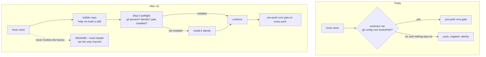

# fix: Close the release-verification gaps left by the push policy

## Summary

The autonomous-push policy shipped, but its verification story has three holes: a release gate
that only protects clones where someone remembered to run one git command, a six-item
verification checklist (LAB-223) that has never actually been run, and two publish-pipeline
tickets carrying stale acceptance criteria. This plan closes the hook gap in code, converts two
of the three "manual only" drills into repeatable scripts on the existing `coldread-audit.sh`
pattern, runs all of them for real, and reconciles the three Linear issues against what is now
true.

The organizing bet: **a drill that cannot be re-run is a checkbox, not a test.** The handoff
assumed the credential drill and the instantiation target needed a human with a stopwatch.
`tests/coldread-audit.sh` already proves otherwise — it does fresh-clone, fresh-session,
control-armed verification unattended. Two of the three drills fit that mold.

---

## Problem Frame

Four distinct problems, one release-integrity theme:

1. **The gate is opt-in per clone.** `scripts/release-gate.py` is enforced only by
   `githooks/pre-push`, which runs only when someone has run `git config core.hooksPath githooks`.
   Nothing in a git repo can set that for you. A fresh clone therefore gets *silently unguarded*
   behavior — no warning, no degraded-mode notice — while `CLAUDE.md` and `README.md` both read as
   if the gate is simply on. This is the only un-ticketed item in the handoff.
2. **The history secrets sweep was never run.** The gate's `range` check walks every *outgoing*
   commit, so a committed-then-deleted secret is caught going forward. Pre-existing history has
   never been swept. The repo is small (44 commits, 84 distinct files ever added), so this is
   cheap and should be a committed script, not a one-time grep.
3. **Three drills are formally unrun** — the credential drill, a cold read of the README's public
   promise (which *regressed* when the push policy rewrote `README.md:35`), and the 10-minute
   instantiation target.
4. **Three tickets are out of date.** LAB-223 bundles a dead half (publish the repo — already
   done) with a live half. LAB-232's acceptance list names five factory skills including a
   `content-repurposer` that does not exist; four do. LAB-241 needs its inherited-invariant note
   recorded and nothing more in this repo.

---

## Requirements

| ID | Requirement |
|---|---|
| R1 | A fresh clone driven by the factory agent ends up with the release gate enforced, without the builder knowing git exists. |
| R2 | The pre-existing history secrets sweep runs, is clean, and is re-runnable by anyone. |
| R3 | The credential drill is a script: `.env.example` scaffolds, a real-shaped key is never echoed, `.env` is ignored at any depth, nothing lands in history. |
| R4 | `README.md`'s public promise is accurate about when the factory pushes and what has to be true for the gate to fire. Verified by a cold reader, not by the author. |
| R5 | The 10-minute instantiation target is measured against a genuinely fresh clone and fresh session, with a recorded number. |
| R6 | Drill results are written down where a future session can find them without re-deriving. |
| R7 | LAB-223, LAB-232, and LAB-241 reflect reality: dead work dropped, machine-covered items marked as covered with a pointer, live work still live. |

---

## Key Technical Decisions

**KTD1 — Close the hooksPath gap in the agent's preflight, not with CI.**
The factory agent runs every git operation, and it already has a preflight step that checks git
presence and identity. Adding "is the gate installed" to that check closes the gap for the entire
population that uses the factory as designed, at the cost of one line. The alternative —
a GitHub Actions workflow running the gate server-side — was rejected on threat model: the harm
here is a secret reaching a public repo, and post-push detection happens after the secret is
already public. It would also require widening `AUTHORIZED_PREFIXES` to admit `.github/`, growing
the publishable surface to buy a check that fires too late.

**KTD2 — A stranger's un-driven clone stays a documentation problem.**
Nothing inside a repo can install its own hooks. For someone who clones and never invokes the
factory, `README.md` and the hook's own header comment are the only channels. Accept this and say
it plainly rather than pretending the gate is unconditional.

**KTD3 — Drills follow the `coldread-audit.sh` shape, not the pytest shape.**
Each drill gets a throwaway clone with its own local bare remote (so the closeout guard stays
quiet) and, where behavior is the thing under test, a real headless session. They stay out of
`tests/test_release_gate.py` and out of the pytest run: they cost real model sessions and minutes.
Run by hand, like the cold-read audit.

**KTD4 — The credential drill splits mechanical from behavioral.**
`.env` ignore-at-depth and history cleanliness are pure git facts and get asserted directly.
"The key is never echoed back" is a model-behavior claim and needs a session that is actually
handed a key. Both halves live in one script; only the second costs a session.

**KTD5 — Bump `plugin.json` to 0.3.3 in a single commit touching all three version fields.**
U2 changes skill behavior that ships to installers. The gate's `versions` check requires
`plugin.json`, `marketplace.json:metadata.version`, and `marketplace.json:plugins[0].version` to
agree, so the bump is atomic or the push is blocked.

---

## Scope Boundaries

**In scope:** the hook gap, the history sweep, three drills plus their scripts, a README accuracy
pass, drill result records, and reconciliation of three Linear issues.

### Deferred to Follow-Up Work

- **LAB-241's actual publish pipeline.** The `publish-skill` operation is a separate design
  project against a spec that lives outside this repo. This plan only records the invariants it
  inherits from the gate; it builds nothing.
- **LAB-232's live-loader verification** — whether a plugin-installed copy double-registers
  against project-level auto-discovery. That needs a real `claude plugin install` against the
  published marketplace, which is an environment test, not a repo change. It stays open on the
  ticket with the correction applied.
- **Server-side gate enforcement (CI).** Rejected for now per KTD1; revisit only if the repo gains
  contributors who push without the factory agent.

### Not in scope

- Any change to the gate's check logic. The 34 tests pin regression classes; this plan adds
  callers and drills, not checks.
- History rewriting of any kind, including if the sweep finds something. A finding would be
  escalated, not silently scrubbed.

---

## High-Level Technical Design

Where enforcement comes from, before and after:



The drill scripts share one shape, borrowed from `tests/coldread-audit.sh`:

```text
mktemp -d  →  clone the repo into it  →  give the clone its own bare remote
           →  push it fully (closeout guard stays quiet)
           →  run the thing under test
           →  assert / measure  →  trap-cleanup the temp dir
```

---

## Implementation Units

### U1. Full-history secrets sweep, as a committed script

**Goal:** Answer the never-answered "is the pre-existing history clean" question with something
re-runnable.

**Requirements:** R2

**Dependencies:** none

**Files:**
- `tests/secrets-sweep.sh` (new)
- `docs/verification/2026-08-11-lab-223-drills.md` (new — result recorded here)

**Approach:** Walk every blob reachable from every ref (`git rev-list --all --objects`), plus every
path ever added, and match against two families: filename shapes (`.env`, `*.pem`, `*.key`,
`*credential*`, `*secret*`) and content shapes (provider key prefixes, long base64/hex runs,
`PRIVATE KEY` headers, `Authorization:` literals). Exit non-zero on any hit and print the
object plus the commit that introduced it. Deliberately tolerant of false positives — a sweep
that under-reports is worse than one that makes you look.

Skip the repo's own known-benign matches by *path allowlist* only (e.g. `.gitignore`'s literal
`.env` line, `.env.example` fixtures under `templates/`), never by silencing a pattern.

**Patterns to follow:** `tests/coldread-audit.sh` for `set -u`, trap-cleanup, and header comments
that explain *why* the check exists.

**Test scenarios:**
- A clean history exits 0 and prints the count of objects scanned.
- A synthetic repo with a key-shaped string in a *deleted* file still reports it (the exact class
  the gate's `range` check exists for — proves the sweep looks at history, not the tree).
- A synthetic repo with `.env` committed at any depth reports it.
- `templates/`'s tracked `.env.example` content does not trip the content patterns.
- Running against this repo today: expected clean (44 commits, 84 files, no suspicious filenames
  in a preliminary pass — the script must confirm, not assume).

**Verification:** The script runs clean against this repo, and against a synthetic dirty fixture it
exits non-zero naming the offending object.

---

### U2. Close the hooksPath gap in the factory's preflight

**Goal:** A fresh clone driven by the factory ends up gate-enforced without the builder doing
anything.

**Requirements:** R1

**Dependencies:** none

**Files:**
- `.claude/skills/build-skill/SKILL.md` (Step 0 — Preflight)
- `.claude/skills/improve-skill/SKILL.md` (Step 2 — Preflight)
- `CLAUDE.md` (`## The silent-git contract` — restate as an agent duty, not a human instruction)
- `githooks/pre-push` (header comment: name the preflight as the normal install path)
- `tests/test_release_gate.py` (`PushEnforcement` — one new case)

**Approach:** Extend the existing silent preflight with a third check alongside git-present and
identity-configured: if `git config --get core.hooksPath` is not `githooks` *and* `githooks/pre-push`
exists in this repo, set it. Silent, no builder-facing output, no git vocabulary — same posture as
the identity check. In degraded no-git mode the check is moot and skipped.

`CLAUDE.md` currently reads "Install it once per clone — `git config core.hooksPath githooks`",
which addresses a human who may never appear. Rewrite it as: the agent installs it during
preflight; a clone nobody drives is unguarded and the README says so.

**Execution note:** This edits SKILL.md prose in two skills, which the review gate classifies as a
behavior/judgment rewrite. Bracket it: `build-skill/rollback-1` and `improve-skill/rollback-2`
before, `review-<n>` on the shipped commit, and hand over an output receipt. It ships either way —
the gate is post-ship.

**Patterns to follow:** the existing degraded-no-git branch in `build-skill` Step 0 — same
"check, act, stay silent, never expose git" shape.

**Test scenarios:**
- New `PushEnforcement` case: a fixture clone with `core.hooksPath` *unset* pushes an
  unauthorized path successfully — pinning the gap as a real, reproducible property rather than a
  claim in a doc. (This is the regression this unit exists to make visible; it documents the
  residual risk for un-driven clones.)
- Existing `PushEnforcement` cases still pass with `hooksPath` set — no behavior change to the hook
  itself.
- `test_release_gate.py` still passes at 34+ cases.

**Verification:** In a throwaway clone with `core.hooksPath` unset, invoking `build-skill` leaves
`core.hooksPath` = `githooks`, and a subsequent bad push is blocked.

---

### U3. README accuracy pass on the public promise

**Goal:** `README.md` describes what the factory actually does, including what has to be true for
the gate to fire.

**Requirements:** R4

**Dependencies:** U2 (the README should describe the post-U2 behavior)

**Files:**
- `README.md` (lines ~19-21 Requirements, ~35 the clone promise)
- `tests/coldread-audit.sh` (one new question)

**Approach:** Three known inaccuracies to resolve, plus whatever the cold read surfaces:

1. Line 35 says the factory "pushes only when the remote is yours and you can write to it."
   Write access is necessary but not sufficient — every push also runs the release gate, and the
   gate is only installed once the factory has run its preflight. Say both.
2. Line 21's credential promise ("real `.env` files are gitignored and never committed") is
   correct but unverified; U4 verifies it. Keep the wording, cite nothing that isn't proven.
3. The bootstrap appendix checklist (line 83) already asserts the `.env` property — it should point
   at the drill rather than asking the reader to hand-check.

Add a question to the cold-read audit's prompt block asking a zero-history reader, from
`README.md` alone: *when does this factory push, and what has to be installed for that to be safe?*
A reader who cannot answer means the wording is still wrong.

**Test scenarios:**
- Cold-read audit run: the new README question is answered correctly in the post arm.
- Existing Q1a still flips between arms; Q2 and Q3 still hold in both (the audit's own contract).

**Verification:** Cold read of `README.md` by a fresh session yields an accurate account of push
conditions.

---

### U4. Credential drill script

**Goal:** Make the credential promise testable rather than asserted.

**Requirements:** R3

**Dependencies:** U1 (reuses the sweep for the history-clean assertion)

**Files:**
- `tests/credential-drill.sh` (new)
- `docs/verification/2026-08-11-lab-223-drills.md` (result recorded)

**Approach:** Throwaway clone with its own bare remote. Mechanical half, asserted directly:
scaffold a skill folder containing `.env.example`; write a real-shaped key
(`sk-ant-api03-` + random) into `.env` at two depths — repo root and inside the skill folder;
assert `git check-ignore` covers both; assert `git status --porcelain` shows nothing; commit
everything stageable and assert `tests/secrets-sweep.sh` still exits 0.

Behavioral half, one headless session: hand the session the fake key in the prompt the way a
builder would paste one, ask it to set up credentials for the skill, then scan the full transcript
for the key's literal value and for the variable name. Any occurrence fails the drill. This is the
half the handoff correctly identified as needing a real session — it just does not need a human.

**Execution note:** the key must be synthetic and clearly non-functional. Never run this with a
real credential; the drill's own transcript is written to a temp dir.

**Test scenarios:**
- `.env` at repo root is ignored; `.env` inside `.claude/skills/<name>/` is ignored (the recursive
  claim — `.gitignore`'s `.env` pattern has no slash, so it should match at any depth).
- `.env.example` is *not* ignored and stages normally.
- After the drill's own commits, the history sweep is clean.
- The session transcript contains neither the key value nor an echo of the variable name.
- A deliberately-broken control: a fixture whose `.gitignore` lacks `.env` fails the drill, proving
  the assertions can fail.

**Verification:** Script exits 0 against this repo; exits non-zero against the broken control.

---

### U5. Instantiation drill script

**Goal:** Measure the 10-minute claim instead of repeating it.

**Requirements:** R5

**Dependencies:** U2 (the preflight change is part of what gets timed)

**Files:**
- `tests/instantiation-drill.sh` (new)
- `docs/verification/2026-08-11-lab-223-drills.md` (measured number recorded)

**Approach:** Fresh clone into a temp dir with its own bare remote, fresh headless session, a
stopwatch around a single prompt: *"help me build a skill"* followed by a canned describe-first
workflow description (frozen in the script so the measurement is repeatable — a different
description on each run measures nothing). Stop the clock when a skill folder exists with a
committed `SKILL.md` and a `cases/baseline/` directory. Report elapsed seconds and pass/fail
against the 600s target.

Record what the drill can and cannot see: it measures the agent's path, not a human's typing and
reading time. The README's "under 10 minutes, most of it the clone" claim covers a human; this
number is a floor, not the claim itself. Say so in the output rather than overstating it.

**Test scenarios:**
- Clean run against a fresh clone produces an elapsed time and a pass/fail verdict.
- The end-state assertion is real: a run that produces no committed `SKILL.md` fails rather than
  reporting a fast time.
- Temp dir and bare remote are cleaned up on both success and failure paths.

**Verification:** One recorded run with a real number.

---

### U6. Run all four drills and record the results

**Goal:** The checklist items move from "unrun" to "run, with evidence."

**Requirements:** R2, R3, R4, R5, R6

**Dependencies:** U1, U2, U3, U4, U5

**Files:**
- `docs/verification/2026-08-11-lab-223-drills.md`

**Approach:** Execute `tests/secrets-sweep.sh`, `tests/credential-drill.sh`,
`tests/instantiation-drill.sh`, and `tests/coldread-audit.sh` (with U3's new question) against the
current HEAD. Write one record per drill: what ran, the command, the raw verdict, the date, and —
where a drill measures rather than asserts — the number. Record failures as failures. A drill that
fails gets a finding in this document and either a fix in this plan's scope or an escalation; it
does not get a softened verdict.

**Test scenarios:** `Test expectation: none -- this unit executes and records; the assertions live
in the drills themselves.`

**Verification:** Every LAB-223 acceptance line has either a passing drill behind it, a machine
check named, or an explicit "still unrun and why."

---

### U7. Version bump and release

**Goal:** Ship the change through the gate.

**Requirements:** R1 (delivery)

**Dependencies:** U2

**Files:**
- `.claude-plugin/plugin.json`
- `.claude-plugin/marketplace.json`

**Approach:** `0.3.2` → `0.3.3` across all three version fields in one commit. The `versions` check
fails closed on drift, so a partial bump blocks the push — which is the intended behavior and the
reason this is its own unit rather than a line in U2.

**Test scenarios:**
- `python3 -m pytest tests/ -q` passes.
- `./scripts/release-gate.py --check versions` reports agreement at `0.3.3`.
- The push itself succeeds through `githooks/pre-push` (the honest end-to-end proof).

**Verification:** `main` advances on `augmentgrowth/skill-factory` with the hook having run.

---

### U8. Reconcile the three Linear issues

**Goal:** The tickets say what is true.

**Requirements:** R7

**Dependencies:** U6 (results are the evidence), U7 (shipped)

**Files:** none — Linear only

**Approach:**

**LAB-223** — rescope, do not close. Drop the "push the public repo" half (done: origin exists,
PRs #5–#7 merged, `main` current). Rewrite the acceptance list as three tiers: covered by
machinery (fresh-clone auto-discovery → the gate's `surface` check; CLAUDE.md/AGENTS.md parity →
structurally guaranteed by the symlink), covered by a drill now (secrets sweep, credential drill,
README wording, instantiation), and still open. Link the drill record.

**New issue — hooksPath gap.** File it with the reproduction (a clone without `core.hooksPath` set
pushes ungated), then close it against U2 with the preflight change and the new pinning test as
evidence. Note the residual: a clone nobody drives stays unguarded by design, documented in
`README.md`.

**LAB-232** — correct the acceptance list: four factory skills exist (`build-skill`,
`improve-skill`, `graduate-skill`, `learn-from-session`), not five — `content-repurposer` was never
built. Mark `marketplace.json` present and version-gated. Keep the loader questions
(symlink resolution from a fresh install, double-registration) open — they need a real install,
not a repo change.

**LAB-241** — comment only. Record that `plugin.json`'s version is now an enforced invariant that
the curated-export design inherits, that the gate's `surface` check already validates the exported
shape against a clean checkout, and that manifest sync must stay a separate release-finalizer
commit (folding it into an anneal commit breaks both skill-folder-only staging and
one-anneal-one-commit). Build nothing here.

**Test scenarios:** `Test expectation: none -- issue-tracker hygiene.`

**Verification:** Each of the three issues reads correctly to someone who was not in this session.

---

## Verification Contract

| Gate | Command / check |
|---|---|
| Unit suite | `python3 -m pytest tests/ -q` — 34+ cases, all green |
| Gate diagnostic | `./scripts/release-gate.py` — reports clean (exits 2 by design; never treat as authorization) |
| History sweep | `tests/secrets-sweep.sh` — exits 0 |
| Credential drill | `tests/credential-drill.sh` — exits 0; broken control exits non-zero |
| Instantiation drill | `tests/instantiation-drill.sh` — records a real elapsed time |
| Cold read | `tests/coldread-audit.sh` — Q1a flips between arms; Q2, Q3, and the new README question hold in the post arm |
| Release | `git push` succeeds *through* `githooks/pre-push`, not around it |

---

## Risks & Dependencies

- **The drills cost real model sessions.** U4, U5, and the cold read each spend one or more.
  Budget minutes, not seconds, and expect flakiness from session-level nondeterminism. Mitigate by
  freezing the prompts inside the scripts so reruns are comparable.
- **U2 is a gated change.** Two SKILL.md behavior rewrites need rollback tags before and review
  tags on the shipped commit, plus an output receipt. Skipping the bracket leaves an undo with no
  target.
- **The instantiation drill measures a floor, not the README's claim.** Overstating it in the
  record would be exactly the rubber-stamping the handoff warns about.
- **A sweep finding would change this plan's shape.** If U1 surfaces a real secret in history, stop
  — do not rewrite history as a side effect of this work. Escalate; credential rotation comes
  first and is a decision, not a task.

---

## Open Questions

- **Does the gate's `surface` check genuinely satisfy LAB-223's "fresh-clone run with skills
  auto-discovered"?** It validates the exported shape against a clean checkout, which is close but
  not identical to a loader actually discovering the skills. U8 records it as covered-by-machinery;
  if U5's instantiation drill (which uses a genuinely fresh clone) shows discovery working
  end-to-end, that is the stronger evidence and should be cited instead.
- **Should `tests/` gain a `drills/` subdirectory?** Four scripts is the threshold where the flat
  `tests/` directory starts mixing pytest units with by-hand drills. Deferred — revisit at six.

---

## Definition of Done

- A clone driven by the factory has the gate installed without the builder acting.
- `tests/secrets-sweep.sh`, `tests/credential-drill.sh`, and `tests/instantiation-drill.sh` exist,
  are committed, and have each been run once with the result recorded in
  `docs/verification/2026-08-11-lab-223-drills.md`.
- `README.md` accurately describes push conditions, verified by a cold reader.
- `python3 -m pytest tests/ -q` is green and the push landed through the pre-push hook.
- LAB-223 is rescoped, the hooksPath issue is filed and closed with evidence, LAB-232 is corrected,
  and LAB-241 carries its invariants note.
